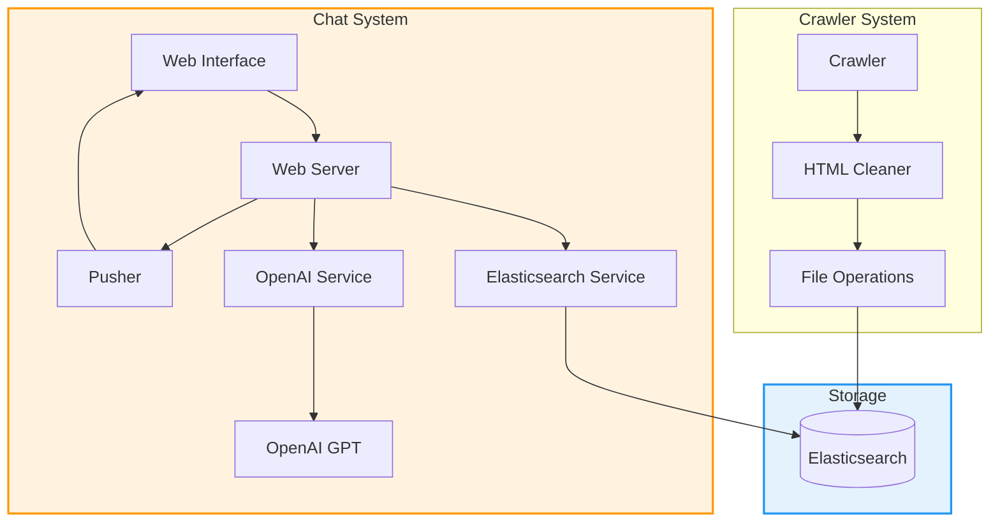
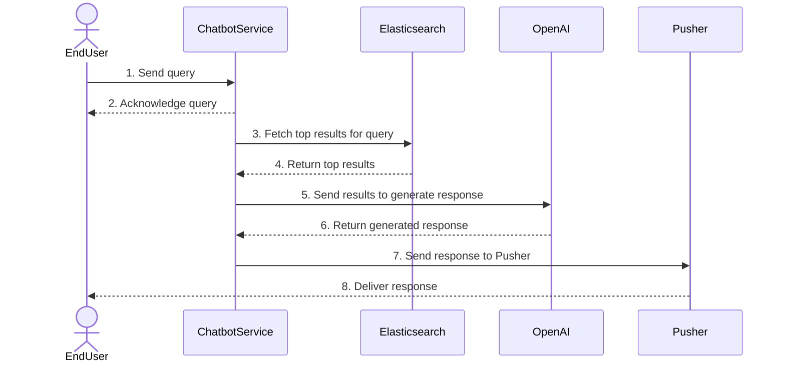
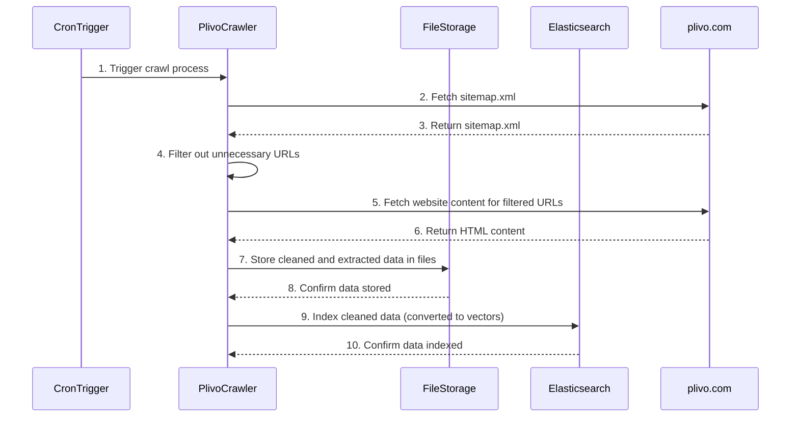

# Minimalistic AI-powered Chatbot

A robust web crawler and chatbot system that processes sitemaps, extracts content, indexes it in Elasticsearch, and provides AI-powered responses through a chat interface. The system supports multiple concurrent users and maintains conversation context.

## Key Features

- 🕷️ Intelligent web crawling with sitemap processing
- 🧹 Advanced HTML content cleaning and extraction
- 🔍 Vector search powered by Elasticsearch
- 🤖 OpenAI GPT integration for natural conversations
- ⚡ Real-time chat updates via Pusher
- 👥 Multi-user support with session management
- 📝 Conversation context maintenance
- 📍 Location-based services integration

## Components

- **Crawler Module**: Handles sitemap processing and content extraction
- **Chatbot Module**: Manages the chat interface and AI responses
- **Elasticsearch**: Stores and indexes content with vector search capabilities
- **OpenAI Integration**: Provides intelligent responses to user queries
- **Pusher**: Enables real-time chat updates
- **Session Service**: Manages user sessions and chat history
- **User Service**: Handles user-specific operations and data

## Architecture



### User Chat Flow Sequence



### Crawler Flow Sequence



## Features

- Sitemap crawling and content extraction
- HTML content cleaning and processing
- Elasticsearch integration for vector search
- OpenAI integration for intelligent responses
- Real-time chat updates via Pusher
- Web interface for chat interactions

## Project Structure

```
src/
├── chatbot/
│   ├── services/
│   │   ├── elasticsearch_service.py
│   │   ├── location_service.py
│   │   ├── openai_service.py
│   │   ├── pusher_service.py
│   │   ├── session_service.py
│   │   └── user_service.py
│   ├── static/
│   │   ├── css/
│   │   ├── js/
│   │   └── index.html
│   └── main.py
├── config/
│   └── config.py                   # Environment and app configuration
├── crawler/                        # Web crawler module
│   ├── file_operations.py         # Content storage and indexing
│   ├── html_cleaner.py           # HTML content extraction
│   ├── run_crawler.py            # Crawler entry point
│   ├── sitemap_crawler.py        # Sitemap XML processing
│   └── url_processor.py          # URL filtering and processing
├── create_es_index.py            # Elasticsearch index setup
└── main.py                       # Main Flask application
```

## Prerequisites

- Python 3.11+
- Elasticsearch 7.17+
- OpenAI API key
- Pusher account credentials


## Setup and Installation

1. Clone the repository:
```bash
git clone git@github.com:rahulagarwal30/chatbot.git
cd chatbot
```

2. Create and activate a virtual environment:
```bash
python -m venv venv
source venv/bin/activate  # On Windows: venv\Scripts\activate
```

3. Install dependencies:
```bash
pip install -r requirements.txt
```

4. Copy and configure environment variables:
```bash
cp .env.example .env
# Edit .env with your configuration
```

## Configuration

Configure the following in your `.env` file:
```
ELASTICSEARCH_URL=http://localhost:9200
OPENAI_API_KEY=your_openai_api_key
PUSHER_APP_ID=your_app_id
PUSHER_KEY=your_key
PUSHER_SECRET=your_secret
PUSHER_CLUSTER=your_cluster
REDIS_URL=redis://localhost:6379
```

## Running the Application

1. Start Elasticsearch locally

2. Create the index:
```bash
python src/create_es_index.py
```

3. Run the crawler to populate the index:
```bash
python src/crawler/run_crawler.py
```

4. Start the web server:
```bash
python src/main.py
```

5. Access the chat interface:
```
http://localhost:5001
```

## Environment Variables

- `ELASTICSEARCH_URL`: Elasticsearch connection URL
- `OPENAI_API_KEY`: OpenAI API key for GPT integration
- `PUSHER_APP_ID`: Pusher application ID
- `PUSHER_KEY`: Pusher key
- `PUSHER_SECRET`: Pusher secret key
- `PUSHER_CLUSTER`: Pusher cluster region

## Additional Configuration

- `FILE_AGE_DAYS`: Number of days before re-fetching URL content (default: 2)
- `MAX_URLS_TO_PROCESS`: Limit the number of URLs to process (-1 for all)

